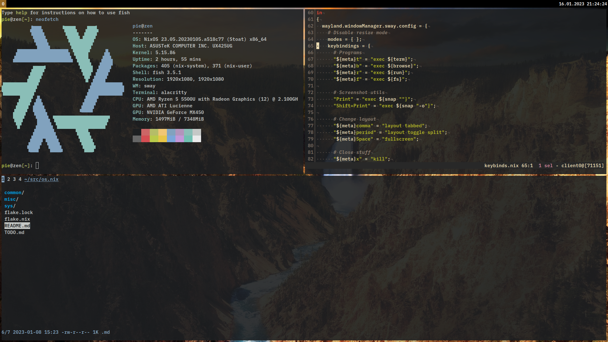

# os.nix
The source files that make up my NixOS setup(s)!

# Pics

# The stuff I use
Most of this can also be found under my `setup` GitHub list.
- [sway](https://github.com/swaywm/sway): window manager
- [fish](https://github.com/fish-shell/fish-shell): shell
- [alacritty](https://github.com/alacritty/alacritty): terminal emulator
- [kakoune](https://github.com/jarun/nnn): text editor
- [nnn](https://github.com/mawww/kakoune): file browser
- [bemenu](https://github.com/Cloudef/bemenu): launcher

# Thanks!
These are some sources that helped me understand NixOS! Thank you:
- [NixOS wiki](https://nixos.wiki/wiki/Flakes#Flake_schema)
- [NixOS options search](https://search.nixos.org/options)
- [Home Manager options](https://nix-community.github.io/home-manager/options.html)
- [rycee](https://git.sr.ht/~rycee/configurations)
- [notusknot](https://github.com/notusknot/dotfiles-nix)
- [oxalica](https://github.com/oxalica/nixos-config)
- [kloenk](https://github.com/Kloenk/nix)
